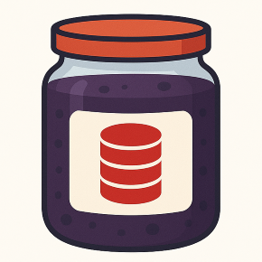
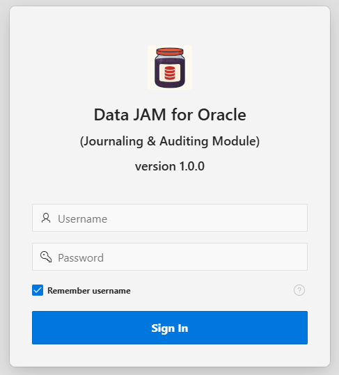
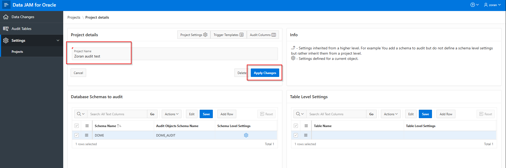
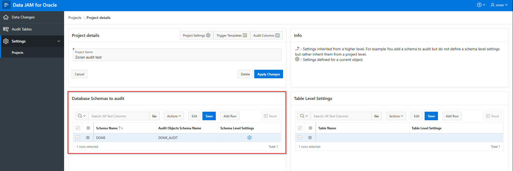
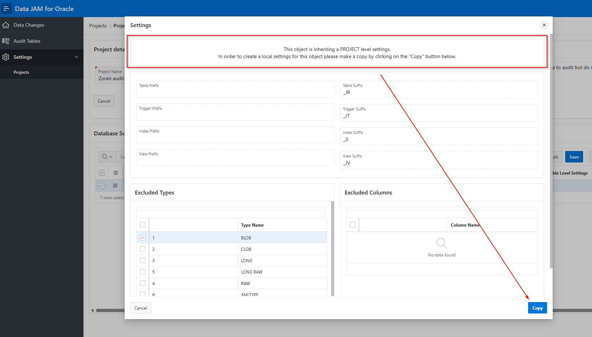
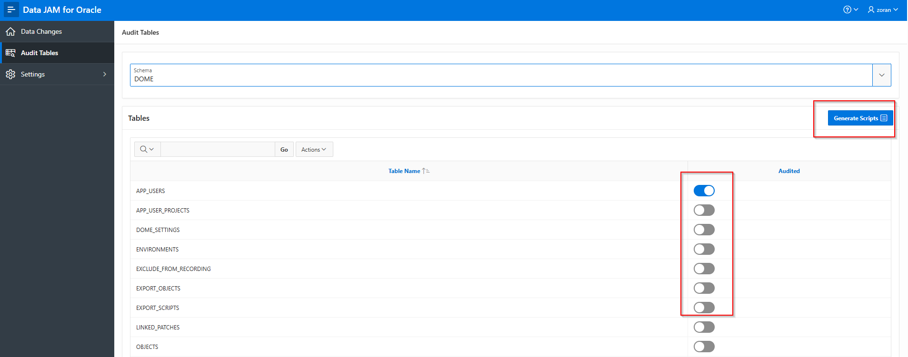
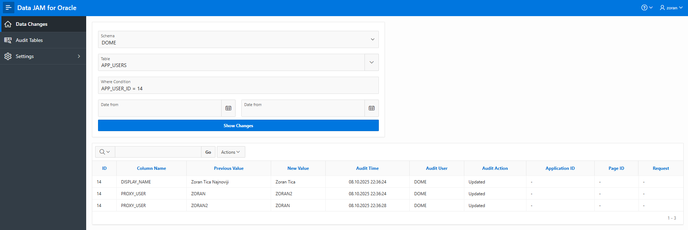

# Data JAM for Oracle (Journaling & Auditing Module)

Data JAM for Oracle is an Oracle Database product / utility designed to automate the auditing of DML data changes in desired database schemas and tables.

It's usage simplifies the tracing of data changes and provides answers on various questions like:

- Who changed the record in the table?
- When?
- What was changed?
- From which application or client tool?
- From which IP address?

It can also assist developers during the debugging of the program logic or during the data restauration.

How can Data JAM do that?

- By generating scripts for necessary database objects in order to capture a complete audit trace of all INSERT, UPDATE, and DELETE operations.
- By analysing actual data changes which occured in table records.

## Key Features

**Automated Data Auditing:** Generates audit tables and triggers with a few clicks, creating an auditing mechanism.

**Built-in Audit Viewer:** A user-friendly GUI developed in Oracle APEX to easily query, filter, and analyze the audited data changes.

**Flexible Standards:** Define your own naming standards for all audit objects.

**Highly Configurable:** Fine-tune auditing by excluding specific columns based on names or data types. Define custom audit information like app ID, page ID, module, IP address, computer name, APEX request...

**Customizable Core:** Modify the audit trigger template to implement custom auditing logic.

## How does the Data Auditing work

Every monitored table contains a set of audit database objects:

- Audit table which stores audit data. This table contains the same columns as the monitored table PLUS audit information columns (like audit user, audit timestamp...).
- Audit DML trigger which is created on the monitored table. It is actually writing audit data in the audit table.
- Audit index in the audit table for faster data access and analysis.
- Appropriate grants for data auditing and data analysis.

When the data is changed in the monitored table, the whole changed record is copied in the audit table. Additionally, audit information columns like audit user and audit timestamp are also populated.

Actual data changes are analysied later on from the Data JAM application UI on the user request.

Audit table can be located in a separate database schema (recommended) or in the same schema as the monitored table.

## Installation instructions

- Download the APEX application [from the install folder](https://github.com/zorantica/data-jam/blob/main/install/jam.sql).
- Install the application in the desired workspace together with supporting objects. *Ignore he fact the application wants to execute the upgrade of supporting objects even if it goes for a clean new install.*
- Be sure the appropriate SELECT privileges are assigned to the database user where the JAM is installed (You may check the helper script for database user generation [located in the install folder](https://github.com/zorantica/data-jam/blob/main/install/user.sql)). Assigned SELECT privileges are checked during the application installation.
- Use APEX accounts to log into the application.

## How to use Data JAM

### Locate and rename the Project

When a Data JAM is freshly installed there is a default project created. Project holds all necesarry settings and naming conventions for audit objects.

You should rename the project for Your purposes and apply changes.

### Select a monitored schema and assign a schema for audit objects

On Project details page add a new monitored schema and assign an audit schema which is going to hold audit tables, data and other necessarry database objects.

### Do the Initial Setting

Before staring to produce scripts for audit objects You should do the initial settings which have the direct impact on naming conventions, audited columns in tables, audit trigger PL/SQL code and audit information columns.

There are 3 levels of settings:

- Project level
- Monitored Schema level
- Single table level

And all of the following settings can be set on one of those levels.

Settings are inherited from the level above. For example, when You add a new monitored schema it automatically inherits settings from the project itself. But if You need to alter settings for this monitored schema only You should create a copy of settings and then alter it.

#### Naming Conventions

Naming conventions can be set for audit table, trigger and index objects.

They cover naming prefix and suffix. Based on those an actual audit object name is calculated as prefix plus monitored table name plus suffix.

For example if You selected a suffix _J for a table name and You monitor the table APP_USERS, the audit table name should be APP_USERS_J.

#### Excluded Columns by Data Type

Certain columns can be excluded from auditing based on their data type. The list of suct data types can be entered 

#### Excluded Columns by Name

Certain columns can be excluded from auditing based on their name. This can be useful for certain sensitive data or for example if You already have some sudit columns in tables and You don't need to audit them (like CREATED_DT, CREATED_BY and similar).

#### Trigger Template

Trigger template can be altered to a certain degree but all the placeholders need to kept for auditing mechanism to work.

For example You might add some custom conditions on when to audit data, let's say to audit data changes made from only for a ceretain application(s).

#### Audit Information Columns

First 3 audit information columns hold information on who changed a record, when and in which way. Additional columns can be created to hold additional audit information such as application ID, page ID, APEX request, IP address or computer name of the client.

### Mark tables to audit or to remove from audit

Open a page for marking tables.

Select a schema for which You want to mark tables. A list of tables is displayed below.

Simply turn the swith on for desired tables in the column Audited. 

Click on the button Generate Scripts and all the scripts are going to be downloaded.

For already audited tables only a newly created columns are going to be included in the scripts. Those tables have the switch already set to Yes.

If You do not want to audit a table any more then simply set the switch to No, click on the button and the appropriate scripts are going to be generated.

Generated scripts are separated by the database schema in which they need to be executed. Some are related to monitored schema and others to audit objects schema.

### Display actual data changes

Landing page in the application is used for displaying actual data changes.

Please select a schema, a table and (recommended) set a where condition. Usually changes are requested for a single record in the table. So, there is a helper. When You select a table, it's primary key is automatically set in the where condition item.

Click on Show changes button and display changes.

Data changes are shown in the table below with the following columns

- Record ID
- Column name where the change is detected
- Previous and new value
- Audit time or when the change happened
- Audit user or who changed the data
- Audit action or what happened (record was inserted, updated or deleted)
- Additional audit columns defined in settings

## DBA Remarks

From DBA perspective it is recommended to create a separate schema and separate tablespace for audit data.

Also, in a dynamic systems with many DML changes the amount of audit data can be significant. Therefore it is recomended to monitor the audit data tablespace size.

Data auditing should not produce a significant impact on the performances of the database because the audit mechanism uses BULK data processing and not row-by-row.

## Changelog

- 1.0.0 - Initial Release
